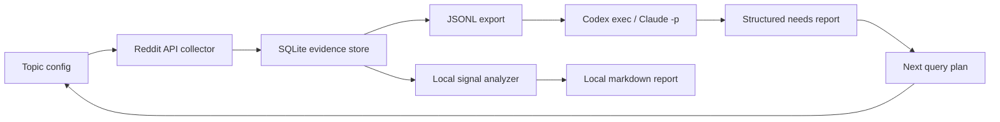

# Reddit Needs Researcher: 2026年6月 技術実現性調査

## 結論

技術的には実現可能です。ただし、現実的な V1 は「Reddit を agent が自由にブラウズする」ではなく、「承認済み Data API クライアントが低頻度で収集し、Codex/Claude が保存済み evidence を分類・要約・次クエリ生成する」形にするべきです。

理由は単純で、Reddit 側の 2026年公式情報では、Data API は承認・OAuth・一意 User-Agent・rate limit 監視が前提になっているためです。ブラウザスクレイピングや未認証 JSON endpoint を前提にすると、技術的にも運用的にも不安定です。

## Reddit 側の最新仕様・制約

2026年5月11日更新の Reddit Data API Wiki は、Data API 利用には Responsible Builder Policy / Developer Terms / Data API Terms が適用されること、リクエストには OAuth token が必要で、未識別ユーザーは throttle/block されること、一意で説明的な User-Agent が必要なことを明記しています。rate limit は `X-Ratelimit-Used`、`X-Ratelimit-Remaining`、`X-Ratelimit-Reset` を監視し、無料アクセス対象では OAuth client id ごとに 100 QPM、10分窓平均で burst を許容すると説明されています。未認証または login credentials なしの traffic は block され、標準 rate limit は適用されません。

Source: [Reddit Data API Wiki](https://support.reddithelp.com/hc/en-us/articles/16160319875092-Reddit-Data-API-Wiki)

2026年5月18日更新の Responsible Builder Policy は、API 経由で Reddit data にアクセスする前に access request と明示的承認が必要、アクセス方法や目的を偽ってはならない、制限回避や過剰利用は禁止と説明しています。アプリ/自動 activity では登録・目的/範囲の明確化が要求されます。商用利用は書面承認が必要で、AI training や re-identification なども明確に制限されています。

Source: [Responsible Builder Policy](https://support.reddithelp.com/hc/ja-jp/articles/42728983564564-%E8%B2%AC%E4%BB%BB%E3%81%82%E3%82%8B%E3%83%93%E3%83%AB%E3%83%80%E3%83%BC%E3%83%9D%E3%83%AA%E3%82%B7%E3%83%BC)

Reddit の Developer Platform / Accessing Reddit Data ページでは、Data API は approved developers が content に programmatic access するためのものと説明されています。commercial use は事前許可・契約が必要で、research については Reddit For Researchers が公式経路だとされています。

Source: [Developer Platform & Accessing Reddit Data](https://support.reddithelp.com/hc/en-us/articles/14945211791892-Developer-Platform-Accessing-Reddit-Data)

## API 技術面

Reddit の built-in live API documentation は Listing の pagination を `after` / `before` / `limit` / `count` で扱うと説明しています。V1 collector は page number ではなく `after` cursor を使う前提にします。comment 展開の `morechildren` は同時実行不可の注意があるため、V1 では comment endpoint の返す範囲だけを扱い、必要になったら単一 request queue で追加展開します。

Source: [reddit.com API documentation](https://www.reddit.com/dev/api/)

PRAW 7.8.2 は Reddit API wrapper として実績があり、OAuth flow、read-only mode、comment extraction、rate limit handling を提供しています。特に PRAW は `X-Ratelimit-*` headers を尊重し、JSON body による unknown ratelimit も `ratelimit_seconds` 以内なら sleep/retry します。Async PRAW も同様の考え方です。依存追加の確認後なら、直接 HTTP から PRAW/Async PRAW へ切り替える価値があります。

Sources:
- [PRAW Authentication](https://praw.readthedocs.io/en/stable/getting_started/authentication.html)
- [PRAW Comment Extraction](https://praw.readthedocs.io/en/stable/tutorials/comments.html)
- [PRAW Ratelimits](https://praw.readthedocs.io/en/stable/getting_started/ratelimits.html)
- [Async PRAW configuration](https://asyncpraw.readthedocs.io/en/latest/getting_started/configuration/options.html)

## Codex / Claude Code 自動化

Codex は `codex exec` で非対話実行できます。`--json` で JSONL event stream、`--output-schema` で最終応答を JSON Schema に準拠させ、`--output-last-message` で最終応答をファイル保存できます。automation では read-only sandbox を既定にし、必要最小限の権限で走らせる設計が合います。

Source: [Codex manual](https://developers.openai.com/codex/codex-manual.md)

Claude Code は `claude -p` / `--print` で非対話実行できます。公式 CLI reference では `--output-format json`、`--json-schema`、`--max-turns`、`--mcp-config` などが提供されています。programmatic usage docs は、Agent SDK が CLI/Python/TypeScript から利用でき、`claude -p` は headless automation に使えると説明しています。`--bare` は script/CI で推奨されますが、OAuth/keychain を読まないため API key 前提です。

Sources:
- [Claude Code CLI reference](https://code.claude.com/docs/en/cli-reference)
- [Run Claude Code programmatically](https://code.claude.com/docs/en/headless)
- [Claude Agent SDK structured outputs](https://code.claude.com/docs/en/agent-sdk/structured-outputs)

## 推奨アーキテクチャ

### Component

- `Topic config`: subreddit、query、sort、time filter、post/comment limit、request interval を定義する。
- `Reddit API collector`: OAuth token を取得し、Search/Listings/Comments を取得する。User-Agent と `X-Ratelimit-*` を扱う。
- `SQLite evidence store`: fullname を primary key にして dedupe する。author 保存は既定 off。
- `Local signal analyzer`: `I wish`、`frustrated`、`alternative`、`too expensive` などの悩み・要求 signal を粗く抽出する。
- `Agent runner`: JSONL evidence を Codex/Claude に渡し、schema 付きで機会領域・セグメント・次探索 query を返させる。
- `Next query loop`: agent が出した query を config にレビュー付きで追加し、次回収集に回す。

## 技術的な探索戦略

1. Seed subreddit を少数に絞る。
2. `I wish`, `does anyone know`, `alternative to`, `frustrated with`, `hard to`, `recommend app`, `too expensive` など problem-intent query で search する。
3. 投稿本文だけでなく comment も取得する。ニーズはコメントの反論・代替案・ワークアラウンドに出やすい。
4. まずローカル analyzer で signal score を付け、上位 evidence だけ agent に渡す。
5. agent は「事実抽出」「仮説」「次に検証すべき query」を分けて出力する。
6. 次回 query は人間レビュー後に config に反映する。agent が自動で Reddit へアクセスする loop は V1 では避ける。

## 実装上のリスク

- API access approval が最大の実行リスク。認証情報があっても use case 承認がないと安定利用できない可能性がある。
- 大量 comment 展開は request 数が増えやすい。V1 は post ごとの comment limit を低くし、`morechildren` は保留する。
- Reddit content は削除・非公開化・mod removal で変化するため、保存データの refresh/delete 戦略が必要。
- agent の要約は引用過多・個人属性推定・過剰一般化を起こし得る。schema と prompt で evidence id / confidence / uncertainty を必須化する。
- Claude/Codex の CLI 自動実行はローカル認証・rate limit・subscription/API key の違いで挙動が変わる。まず subprocess wrapper で provider を差し替え可能にする。

## V1 範囲

- 標準ライブラリのみ。
- OAuth client credentials flow。
- Search/Listings/Comments の読み取り。
- SQLite 保存、JSONL export。
- ローカル signal scoring。
- Codex/Claude CLI への schema 付き structured report request。

## V2 候補

- PRAW/Async PRAW 導入。
- Reddit For Researchers や commercial agreement の approved export 取り込み口。
- Embeddings による semantic clustering。
- UI dashboard。
- scheduled collection。
- deletion/retention workflow。
- MCP server 化して Codex/Claude から collector を tool として呼べるようにする。

